# Lab 5 – Microservices with Consul Service Discovery and Config Server

## Requirements

- Docker + Docker Compose
- Python 3.11+
- FastAPI
- Hazelcast
- Consul
- `httpx` for load testing

---

## 1. What was changed in this lab

This lab continues the previous microservices labs. In the previous version, services already existed, but Lab 5 adds Consul as a central service for registration, discovery, and configuration.

In this version, Consul is used for three main things:

- **Service Registry** – each microservice registers itself in Consul when it starts.
- **Service Discovery** – `facade_service` finds `logging_service` and `counter_service` through Consul.
- **Config Server** – Hazelcast and Message Queue settings are stored in Consul Key/Value storage.

The main purpose of this lab is to avoid hardcoded service addresses and move service configuration to Consul.

---

## 2. Architecture

```text
Client
  │
  ▼
facade_service (port 8001)
  │
  ├── discovers logging-service through Consul
  │      ├── logging_service_1
  │      ├── logging_service_2
  │      └── logging_service_3
  │              │
  │              ▼
  │        Hazelcast Distributed Map
  │
  └── sends message to Hazelcast Queue
                 │
                 ▼
          counter_service
                 │
                 ▼
          user balances
```

The client sends requests only to `facade_service`. The facade service does not directly store addresses of other services. It asks Consul for healthy instances and then sends requests to them.

---

## 3. Services in the system

The system contains three main microservices:

- `facade-service`
- `logging-service`
- `counter-service`

In Docker, the project runs:

- `facade_service` – receives client HTTP requests.
- `logging_service_1`, `logging_service_2`, `logging_service_3` – three instances of logging service.
- `counter_service` – processes user balances.
- `consul` – service registry, service discovery, and config storage.
- `hazelcast1`, `hazelcast2`, `hazelcast3` – Hazelcast cluster nodes.
- `consul_kv_init` – initializes required Consul Key/Value configuration.

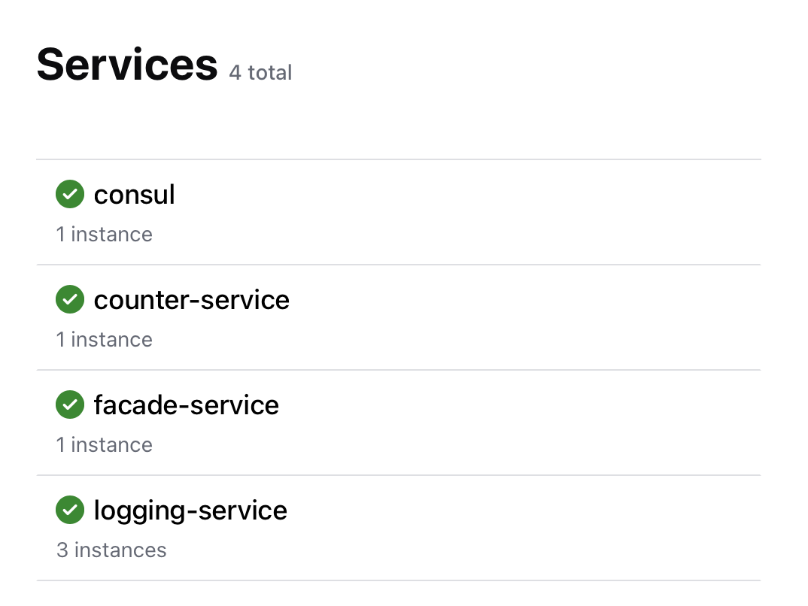

---

## 4. Consul Service Registration

Each microservice registers itself in Consul during startup. The registration contains the service name, service ID, address, port, and health check.

The required services are visible in Consul:

- `facade-service`
- `logging-service`
- `counter-service`

In this project, `logging-service` has three instances. This is useful because if one logging instance is stopped, the facade can still use another healthy instance.

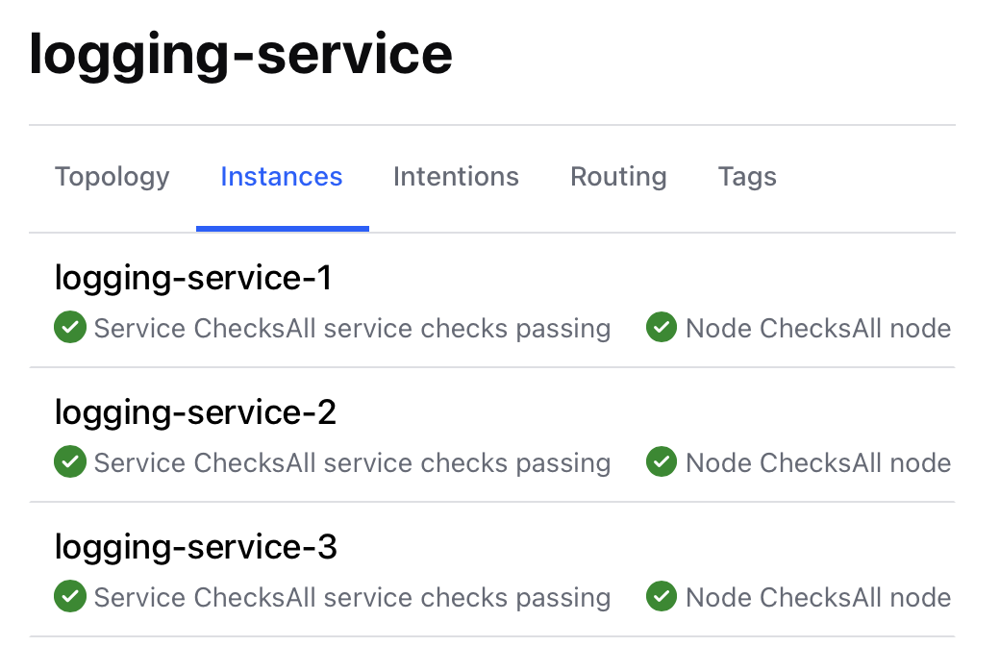

---

## 5. Consul Service Discovery

The `facade_service` uses Consul to find other services.

When a new transaction is created, `facade_service` asks Consul for healthy instances of `logging-service`. Then it sends the transaction to one of the available logging instances.

For balance requests, `facade_service` asks Consul for `counter-service` and sends the request to the discovered service.

This means the facade does not depend on static IP addresses or hardcoded ports of other microservices.

---

## 6. Consul Key/Value Configuration

Consul Key/Value storage is used to keep configuration for Hazelcast and Message Queue.

Hazelcast configuration:

- `hazelcast/hosts`
- `hazelcast/cluster-name`
- `hazelcast/map-name`

Message Queue configuration:

- `message-queue/hosts`
- `message-queue/cluster-name`
- `message-queue/queue-name`

`logging_service` reads Hazelcast configuration from Consul. `facade_service` and `counter_service` read Message Queue configuration from Consul.

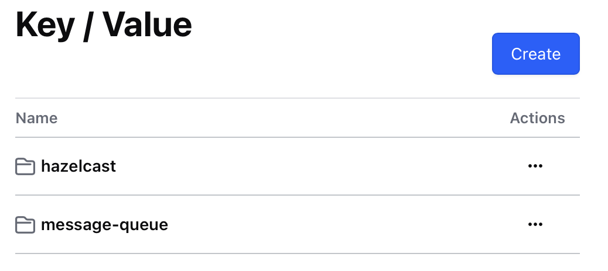

---

## 7. How to run the project

Start all services:

```bash
docker compose up --build
```

Stop all services:

```bash
docker compose down --remove-orphans
```

Consul UI is available here:

```text
http://localhost:8500
```

The main API entry point is:

```text
http://127.0.0.1:8001
```

---

## 8. Basic API test

### POST `/transactions`

I sent a transaction to `facade_service`:

```bash
curl -X POST http://127.0.0.1:8001/transactions \
  -H "Content-Type: application/json" \
  -d '{"user_id":"report_user","amount":1}'
```

The service returned a `transaction_id` and status `queued`.

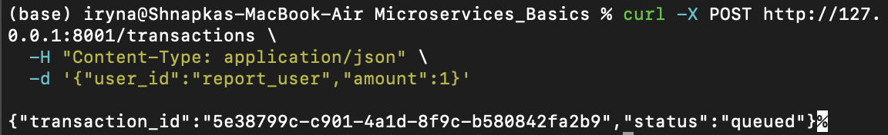

This means that `facade_service` accepted the request, sent it to `logging_service`, and added the message to the queue for `counter_service`.

### GET `/accounts`

Then I checked all balances:

```bash
curl http://127.0.0.1:8001/accounts
```

The response shows all user balances, including `report_user`.

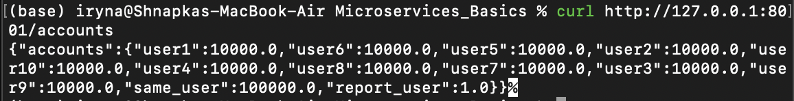

This proves that the transaction was processed and the balance was updated.

---

## 9. Failover test

The task requires showing that the system reacts when one service instance is stopped.

I stopped one logging instance:

```bash
docker stop logging_service_1
```

After this, Consul showed that the state of `logging-service` changed.

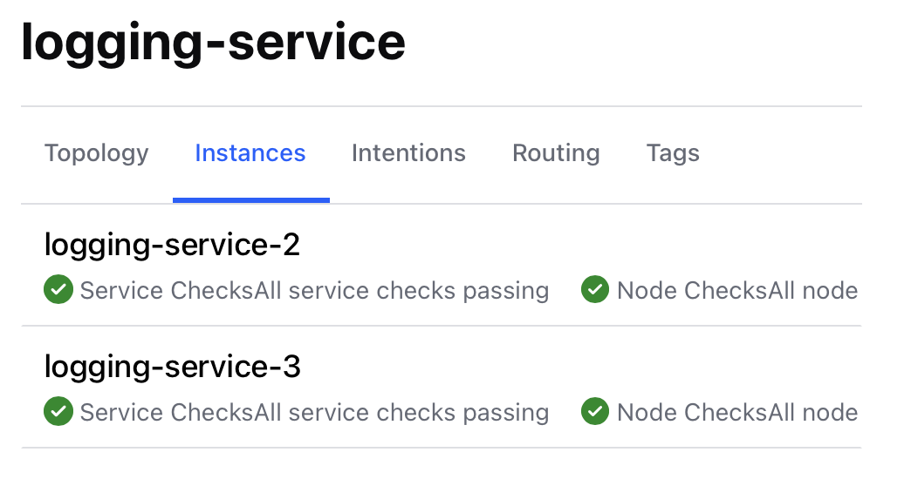

Then I sent another transaction:

```bash
curl -X POST http://127.0.0.1:8001/transactions \
  -H "Content-Type: application/json" \
  -d '{"user_id":"failover_user","amount":1}'
```

The request still worked and returned status `queued`.

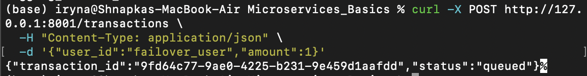

This proves that `facade_service` did not depend on only one logging instance. It discovered another healthy `logging-service` instance through Consul and used it.

After the test, I started the stopped service again:

```bash
docker start logging_service_1
```

---

## 10. Console output

The services print useful startup and processing information. The logs show that services register in Consul and connect to Hazelcast or Message Queue.

Useful commands:

```bash
docker logs facade_service --tail 40
docker logs logging_service_1 --tail 40
docker logs counter_service --tail 40
```

Example log screenshot:


---

## 11. Load test

The load test uses two scenarios from the previous labs:

1. **10 accounts** – 10 users, each sends 10,000 transactions.
2. **1 account** – 10 clients send 10,000 transactions each to the same user.

The script checks that balances are correct after all transactions are processed.

---

## 12. Performance results

### Scenario 1 – 10 users, 10,000 transactions each

Expected result: each user should have balance `10000.0`.

In Lab 5, all balances were correct.

- Total requests: `100000`
- Total time: `3429.85 s`
- RPS: `29.16`
- `logging-service` contribution: `32203.50 s / 96.95%`
- `counter-service` contribution: `1011.63 s / 3.05%`

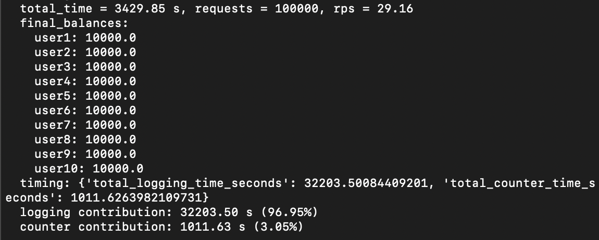

### Scenario 2 – 10 clients, same user

Expected result: `same_user` should have balance `100000.0`.

In Lab 5, the final balance was correct.

- Total requests: `100000`
- Total time: `3260.16 s`
- RPS: `30.67`
- `logging-service` contribution: `31289.83 s / 97.79%`
- `counter-service` contribution: `706.52 s / 2.21%`

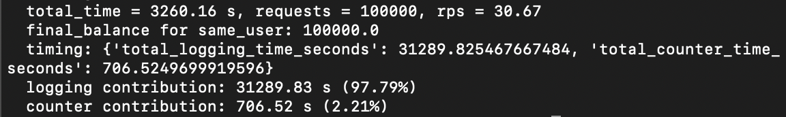

---

## 13. Comparison with previous labs

| Test scenarios | Task 1 (in-mem) | Task 3 (DB) | Task 5 (final) |
|---|---|---|---|
| 10 accounts | Total time:<br>1146.91 s<br>RPS: 87.19 | Total time:<br>846.43 s<br>RPS: 118.14 | Total time:<br>3429.85 s<br>RPS: 29.16 |
|  | logging-service contribution:<br>4355.40 s / 54.96% | logging-service contribution:<br>2774.13 s / 46.41% | logging-service contribution:<br>32203.50 s / 96.95% |
|  | counter-service contribution:<br>3570.53 s / 45.04% | counter-service contribution:<br>3203.06 s / 53.59% | counter-service contribution:<br>1011.63 s / 3.05% |
| 1 account | Total time:<br>1145.38 s<br>RPS: 87.31 | Total time:<br>811.41 s<br>RPS: 123.24 | Total time:<br>3260.16 s<br>RPS: 30.67 |
|  | logging-service contribution:<br>4351.42 s / 54.66% | logging-service contribution:<br>2800.11 s / 47.51% | logging-service contribution:<br>31289.83 s / 97.79% |
|  | counter-service contribution:<br>3609.64 s / 45.34% | counter-service contribution:<br>3093.84 s / 52.49% | counter-service contribution:<br>706.52 s / 2.21% |

Lab 1 screenshots:

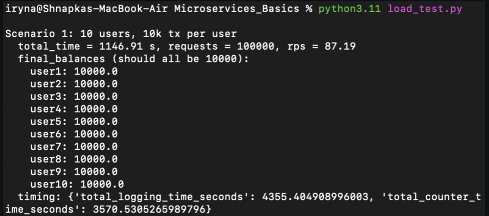

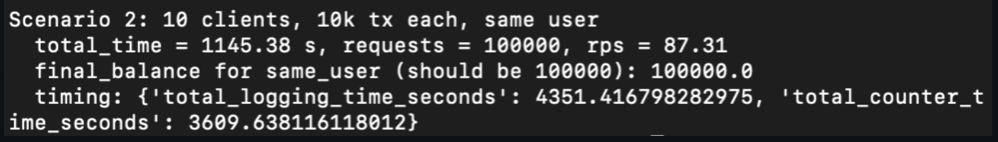

Lab 3 screenshots:

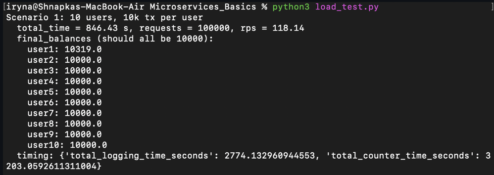

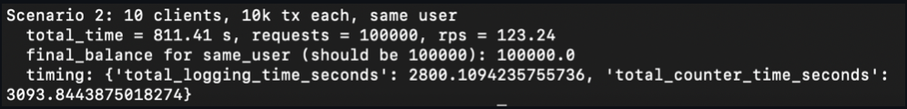

Lab 5 screenshots:


### Analysis

According to the measured results, Task 3 had the lowest total time and the highest RPS in both scenarios. However, this result should not be interpreted as proof that the database version is always faster than the in-memory version. In theory, Task 3 should not be faster than Task 1, because the database adds extra operations, such as storing data, reading data, and handling transactions.

The better result in Task 3 can be caused by implementation details, different runtime conditions, caching, different service load, or measurement differences between labs.

Task 1 was expected to be faster because it stores data in memory. However, in my test results it was slower than Task 3.

Task 5 was clearly the slowest version. In the first scenario, it finished in 3429.85 seconds with 29.16 RPS. In the second scenario, it finished in 3260.16 seconds with 30.67 RPS.

The main bottleneck in Task 5 is the logging-service. It took 96.95% of the measured service time in the first scenario and 97.79% in the second scenario. The counter-service had a much smaller impact.

So, the final version works correctly, but its performance became worse compared to previous labs. The main reason is that the logging-service became the most expensive part of the system.

---

## 14. Performance analysis

The Lab 5 version works correctly, but it is slower than previous versions.

The main bottleneck is `logging-service`. In both scenarios, it takes around 97% of the accumulated measured service time. This happens because every transaction is sent to `logging-service` and stored in Hazelcast.

The `counter-service` contribution is much smaller because it only receives messages from the queue and updates balances.

The accumulated logging and counter times can be higher than the real total test time because many requests are processed concurrently. So these values show accumulated measured service time, not only wall-clock time.

Even though performance is not strong, both required scenarios finished successfully and all balances were correct.

---

## 15. Conclusion

In this lab, I added Consul to the microservice system. Consul is used as a Service Registry, Service Discovery mechanism, and Config Server.

The final system satisfies the main requirements:

- all main microservices register in Consul;
- `facade_service` discovers `logging_service` and `counter_service` through Consul;
- Hazelcast configuration is stored in Consul Key/Value;
- Message Queue configuration is stored in Consul Key/Value;
- several `logging-service` instances can run at the same time;
- the system continues working when one logging instance is stopped;
- both load test scenarios finished with correct balances.

The main weakness of the final version is performance. The load test showed that `logging-service` is the biggest bottleneck. Still, the system works correctly and demonstrates Consul-based service discovery and configuration management.
