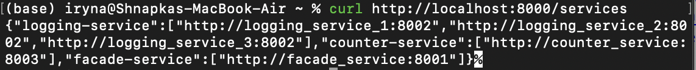
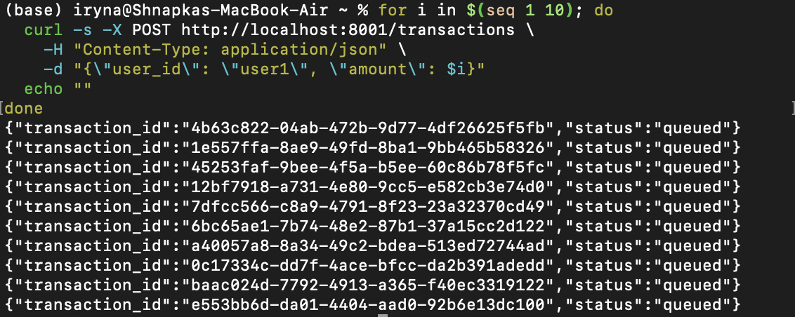
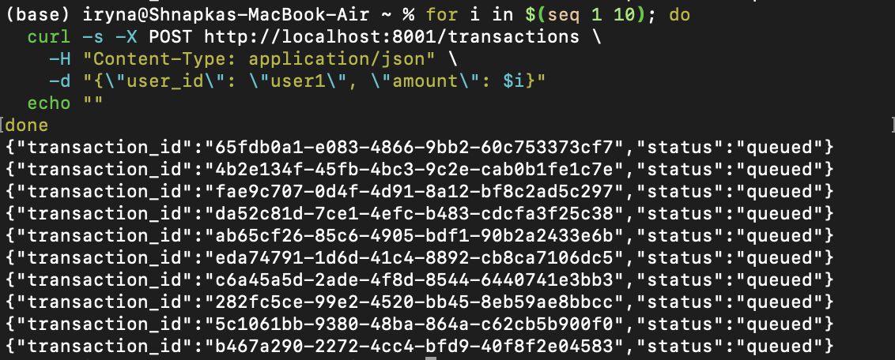
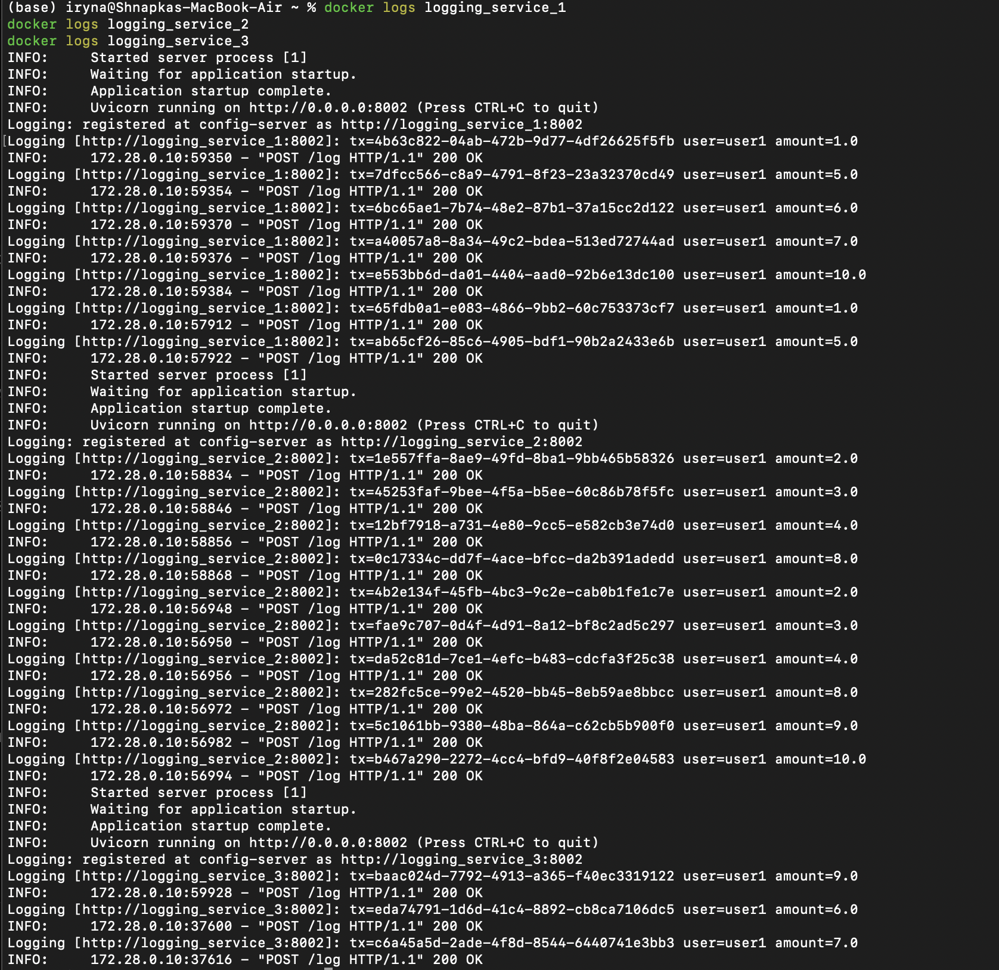
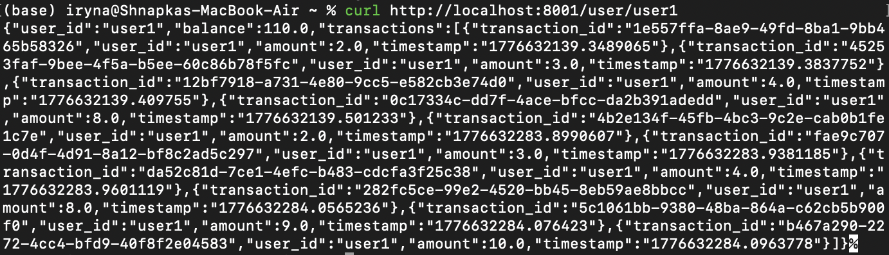
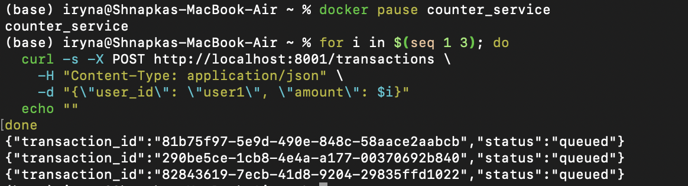
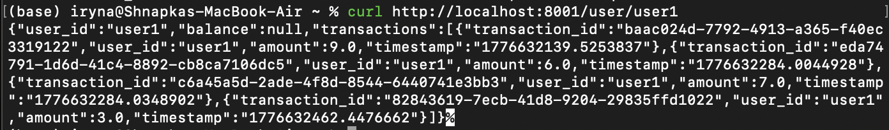
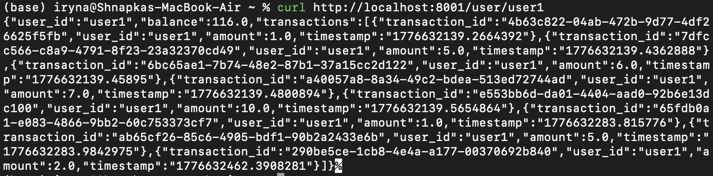

# Lab 4 — Microservices with Messaging Queue

## What this lab is about

In lab I extended the microservices system from the previous lab by adding a **message queue** (Hazelcast Distributed Queue) between `facade-service` and `counter-service`. The idea is instead of waiting for counter-service to update the balance (which could be slow), facade-service just throws the message into the queue and moves on. Counter-service picks it up when it's ready.

I also added a **config-server** that keeps track of all running service instances, so facade-service always knows where to send requests.

---

## System Architecture

| Layer | Service | Port |
|---|---|---|
| Entry point | `facade-service` | 8001 |
| Logging | `logging-service` × 3 | 8002, 8004, 8005 |
| Balance | `counter-service` | 8003 |
| Registry | `config-server` | 8000 |
| Queue nodes | `hazelcast1/2/3` | 5701, 5702, 5703 |

All logging-service containers listen on port **8002 internally**, while different host ports (8002, 8004, 8005) are exposed externally via docker-compose for local access.

**Request flow:**

```
Client
  │
  ▼
facade-service
  ├──► (POST /log) ──► random logging-service instance
  │                    (chosen via config-server)
  │
  └──► (PUT msg) ──► Hazelcast Queue
                          │
                          ▼
                    counter-service
                    (reads & updates balance)
```

**Service registration flow:**

```
logging-service x3 ──┐
counter-service ──────┼──► config-server (registry)
facade-service ───────┘
```

---

## How to run

```bash
docker-compose up --build
```

---

## All services registered on config-server

After running `docker-compose up --build`, all 9 containers started. Each service registers itself on config-server at startup via a POST request. To verify:

```bash
curl http://localhost:8000/services
```



**Result:**

```json
{
  "logging-service": [
    "http://logging_service_1:8002",
    "http://logging_service_2:8002",
    "http://logging_service_3:8002"
  ],
  "counter-service": ["http://counter_service:8003"],
  "facade-service": ["http://facade_service:8001"]
}
```

**Why it works:** Every service reads `CONFIG_SERVER_URL` from its environment variable and sends a POST `/register` request on startup. Config-server stores all URLs in a dictionary grouped by service name. This confirms that all service instances successfully connected to config-server.

---

## Hazelcast cluster — 3 nodes running

To verify that all 3 Hazelcast nodes formed a cluster:

```bash
docker logs hazelcast1 | grep "Members"
```


**Result:** Logs show `Members {size:3}`: all three nodes
discovered each other and formed a single cluster.

---

## First batch of 10 POST transactions

**Note:** The lab description mentions transactions `msg1–msg10`.
In my implementation, transactions are structured JSON objects with `user_id` and `amount` fields, which is a more realistic approach. To demonstrate the required 10 transactions, I sent amounts `1–10` for `user1`, which produces the same result — 10 distinct messages in the queue with unique transaction IDs.

```bash
for i in $(seq 1 10); do
  curl -s -X POST http://localhost:8001/transactions \
    -H "Content-Type: application/json" \
    -d "{\"user_id\": \"user1\", \"amount\": $i}"
  echo ""
done
```



**Result:** All 10 transactions returned `"status": "queued"`.

**Why it works:** Facade-service generates a UUID, logs the transaction to a random logging-service, and puts the message into the Hazelcast Queue — without waiting for counter-service at all.

---

## Additional stability check (second batch)

As an additional stability check (not required), I ran the same loop one more time to confirm that the queue handles multiple batches correctly:



**Result:** All 10 transactions returned `"status": "queued"` again. This confirms the queue is stable and facade-service is stateless — every POST is handled independently.

---

## Logging-service load distribution

After sending the transactions, checked the logs of all three logging-service instances:

```bash
docker logs logging_service_1
docker logs logging_service_2
docker logs logging_service_3
```



**Result:**
- `logging_service_1` received amounts: 1, 5, 6, 7, 10...
- `logging_service_2` received amounts: 2, 3, 4, 8, 9, 10...
- `logging_service_3` received amounts: 9, 6, 7...

**Why it works:** Facade-service calls config-server to get all logging-service URLs and picks one with `random.choice()`. All 3 instances received transactions, confirming that random load balancing works correctly.

---

## GET request, verifying correct balance

```bash
curl http://localhost:8001/user/user1
```



**Result:** `"balance": 110.0`

The balance is 110 because two batches of 10 transactions were sent (amounts 1–10 twice), so 55 × 2 = 110. The full transaction list was returned with all UUIDs and timestamps.

**Why it works:** Counter-service reads messages from the Hazelcast Queue one by one and updates the in-memory balance. Facade-service GET asks config-server for counter-service URL and queries it directly. The correct value confirms all queued messages were consumed successfully.

---

## Fault tolerance: pausing counter-service

I paused counter-service to simulate a failure, then sent 3 more transactions:

```bash
docker pause counter_service
```

```bash
for i in $(seq 1 3); do
  curl -s -X POST http://localhost:8001/transactions \
    -H "Content-Type: application/json" \
    -d "{\"user_id\": \"user1\", \"amount\": $i}"
  echo ""
done
```



**Result:** All 3 transactions returned `"status": "queued"` — no errors at all.

**Why it works:** Facade-service only interacts with the Hazelcast Queue during POST — it never calls counter-service directly. The queue keeps accumulating messages even when the consumer is down. This is the core benefit of async messaging.

---

## GET returns null while counter is paused

While counter-service was still paused:

```bash
curl http://localhost:8001/user/user1
```



**Result:** `"balance": null`

**Why it works:** Facade-service tries to reach counter-service but the connection fails since it is paused. The `try/except` block catches the error and returns `null` instead of crashing. The system stays alive and correctly signals that balance data is temporarily unavailable.

---

## Resuming counter-service, queue drains correctly

I unpaused counter-service and waited a few seconds:

```bash
docker unpause counter_service
```

```bash
curl http://localhost:8001/user/user1
```



**Result:** `"balance": 116.0`

The balance increased from 110 to 116 (+1 +2 +3 from the 3 queued transactions).

**Why it works:** As soon as counter-service comes back online, its background thread resumes polling the Hazelcast Queue with `queue.poll(timeout=1)`. All 3 accumulated messages were processed and the balance was updated correctly. This confirms that Hazelcast Queue durably holds messages until the consumer is ready.

---

## Conclusion

This lab demonstrated how a message queue (Hazelcast Distributed Queue) decouples services and improves fault tolerance. Facade-service never blocks waiting for counter-service, and the system continues to accept transactions even when counter-service is down. Once it comes back, it automatically catches up with all queued messages.
