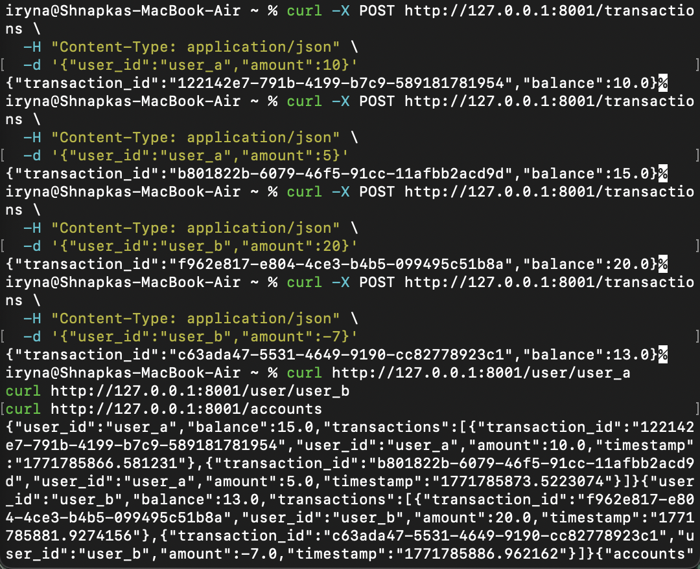
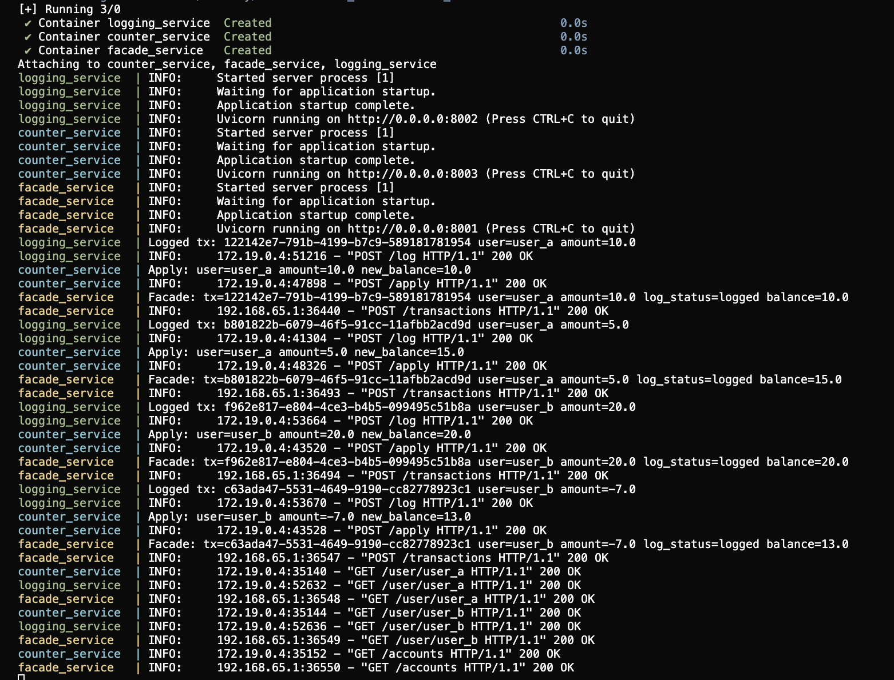
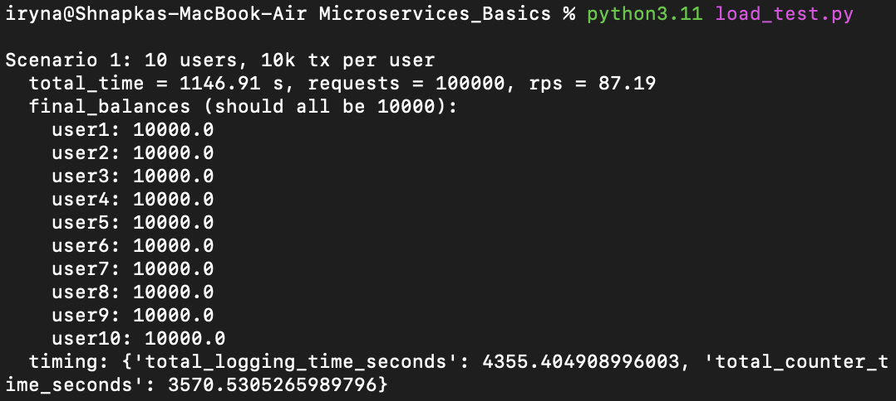
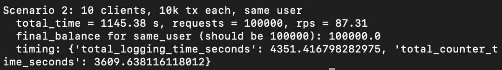

# Microservices Basics – Facade, Logging, Counter

### Requirements

- Python 3.11+
- pip (Python package manager)
- Docker + Docker Compose

### Addditional installations for local run
```bash
pip install fastapi uvicorn httpx
```

## 1. Description

In this project I implemented a small microservices-based system with three FastAPI services and an asynchronous Python client:

- **facade_service** – main HTTP API for clients. It accepts transaction requests, forwards them to the other services, aggregates the responses and returns final results.
- **logging_service** – receives information about each transaction and stores it in an in-memory log so we can see and measure how much logging contributes to total processing time.
- **counter_service** – maintains in-memory balances for users. It applies `+1` operations and returns current balances per user.

I also wrote a load-testing client `load_test.py` (using `httpx` + `asyncio`) that simulates 10 concurrent clients and runs two scenarios from the assignment (separate accounts vs one shared account).

## 2. Basic behaviour

### Run with Docker Compose
From the project root:

```bash
docker compose up --build
```

This starts three containers:
- logging_service on port 8002
- counter_service on port 8003
- facade_service on port 8001
The client and curl commands below talk to facade_service on http://127.0.0.1:8001

  

To verify the basic logic before running load tests, I started all three services (via Docker Compose) and executed several POST /transactions requests with positive and negative amounts for two different users, followed by GET requests to check the final balances.

 

The responses show that:
user_a ends with balance 15.0 and two transactions +10 and +5.
user_b ends with balance 13.0 and two transactions +20 and -7.
/accounts returns both balances (user_a: 15.0, user_b: 13.0).


## Load test scenarios

To test the system under load, I used the `load_test.py` client which simulates 10 concurrent clients and runs two scenarios.  
Both scenarios finished successfully and produced the expected final balances.

### How to run

With all three services running (via Docker Compose):
```bash
python3.11 load_test.py
```

### Scenario 1 – 10 clients, 10k tx each, separate accounts

In the first scenario, 10 virtual clients each send 10 000 `POST /transactions` requests to **their own** account (`user1` … `user10`).  
The expected result is that every account ends with balance 10 000, and the logs show that all updates were applied.

Screenshots:

  
Console output of load_test.py for Scenario 1 with total time (~1146 s), 100 000 requests (≈87 RPS) and final balances 10 000.0 for user1…user10, plus accumulated timing for logging and counter services.

---

### Scenario 2 – 10 clients, 10k tx each, same account

In the second scenario, the same 10 clients each send 10 000 `POST /transactions` requests to **one shared** account (`same_user`).  
The expected result is that `same_user` ends with balance 100 000, and the logs show that all operations on this single account were processed correctly.

Screenshots:

  
Console output of load_test.py for Scenario 2 with total time (~1145 s), 100 000 requests (≈87 RPS), final balance 100 000.0 for same_user, and separate totals for time spent calling logging and counter services.

## Conclusion

The basic manual tests show that the facade, logging and counter services work correctly together:
simple POST /transactions and GET /user/{id} calls update balances as expected, support both positive and negative amounts, and are properly logged by all services.

The two load scenarios confirm that the system handles concurrent traffic correctly:
for 10 clients with 10k transactions each, all separate accounts reach 10 000 and the shared account reaches 100 000 without lost or duplicated updates.

The measured times and request rates demonstrate realistic performance for this architecture and clearly highlight the cost of inter‑service communication and updates to a single shared account under high load.
