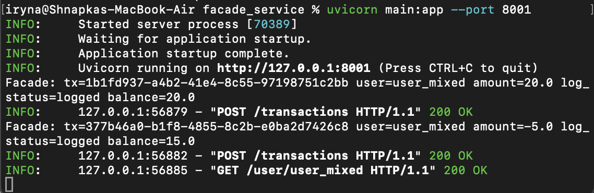
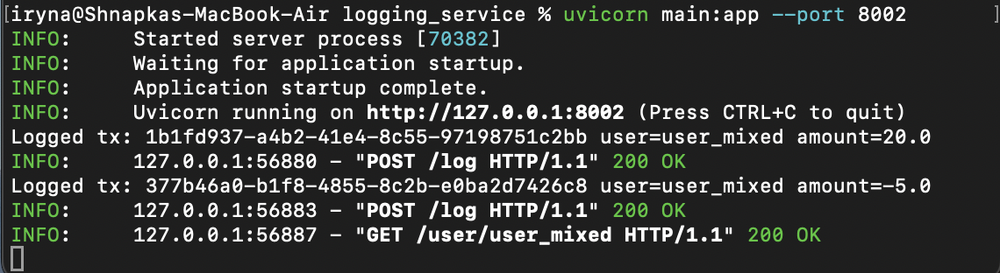
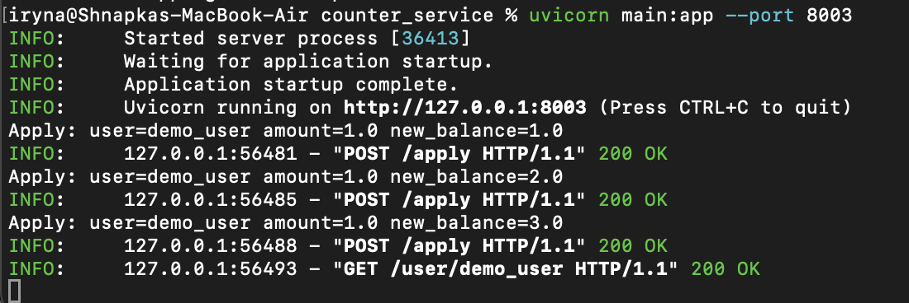

# Microservices Basics – Facade, Logging, Counter

### Requirements

- Python 3.11+
- pip (Python package manager)

### Addditional installations
```bash
pip install fastapi uvicorn httpx
```

## 1. Description

In this project I implemented a small microservices-based system with three FastAPI services and an asynchronous Python client:

- **facade_service** – main HTTP API for clients. It accepts transaction requests, forwards them to the other services, aggregates the responses and returns final results.
- **logging_service** – receives information about each transaction and stores it in an in-memory log so we can see and measure how much logging contributes to total processing time.
- **counter_service** – maintains in-memory balances for users. It applies `+1` operations and returns current balances per user.

On top of this, I wrote a load-testing client `load_test.py` (using `httpx` + `asyncio`) that simulates 10 concurrent clients and runs two scenarios from the assignment (separate accounts vs one shared account).

## 2. Basic behaviour

To verify the basic logic before running load tests, I started all three services and executed three `POST /transactions` requests for `demo_user`, followed by a `GET /user/demo_user`.  
The responses showed that the balance increased from 0 to 3 and that each transaction was logged and applied by the corresponding services.

### How to run the services

Open three terminals:

```bash
# Terminal 1 – logging_service
cd logging_service
uvicorn main:app --port 8002

# Terminal 2 – counter_service
cd counter_service
uvicorn main:app --port 8003

# Terminal 3 – facade_service
cd facade_service
uvicorn main:app --port 8001
```

Screenshots:

  
*Two `POST /transactions` calls for `user_mixed` with `amount = 20` and `amount = -5`, plus the final `GET /user/user_mixed` showing balance 15.0.*

  
*`facade_service` logs showing the `POST /transactions` requests for `user_mixed` (including the negative amount) and the final `GET /user/user_mixed`.*

  
*`logging_service` logs showing two `POST /log` requests for `user_mixed`, including the transaction with `amount = -5`.*

  
*`counter_service` logs showing `POST /apply` calls for `user_mixed` with amounts `20` and `-5`, and the final `GET /user/user_mixed` with balance 15.0.*


## Load test scenarios

To test the system under load, I used the `load_test.py` client which simulates 10 concurrent clients and runs two scenarios.  
Both scenarios finished successfully and produced the expected final balances.

### How to run
```bash
cd /Users/iryna/Desktop/Microservices_Basics
/Library/Frameworks/Python.framework/Versions/3.11/bin/python3.11 load_test.py
```

### Scenario 1 – 10 clients, 10k tx each, separate accounts

In the first scenario, 10 virtual clients each send 10 000 `POST /transactions` requests to **their own** account (`user1` … `user10`).  
The expected result is that every account ends with balance 10 000, and the logs show that all updates were applied.

Screenshots:

  
*Console output of `load_test.py` for Scenario 1 with total time, RPS and final balances for `user1`…`user10`.*

  
*`counter_service` logs showing many `POST /apply` requests for users `user1`…`user10` during Scenario 1.*

---

### Scenario 2 – 10 clients, 10k tx each, same account

In the second scenario, the same 10 clients each send 10 000 `POST /transactions` requests to **one shared** account (`same_user`).  
The expected result is that `same_user` ends with balance 100 000, and the logs show that all operations on this single account were processed correctly.

Screenshots:

  
*Console output of `load_test.py` for Scenario 2 with total time, RPS and the final balance for `same_user`.*

  
*`counter_service` logs showing `POST /apply` requests for `same_user` and the final `GET /user/same_user` call.*

## Conclusion

The basic manual tests show that the facade, logging and counter services work correctly together:  
simple `POST /transactions` and `GET /user/{id}` calls update the balance as expected and are properly logged by all services.

The two load scenarios confirm that the system handles concurrent traffic correctly:  
for 10 clients with 10k transactions each, all separate accounts reach 10 000 and the shared account reaches 100 000 without lost or duplicated updates.

The measured times and request rates demonstrate realistic performance for this architecture and clearly highlight the cost of inter‑service communication and updates to a single shared account under high load.
