# Lab 3 – Microservices with Hazelcast Distributed Map

## Requirements

- Docker + Docker Compose
- Python 3.11+
- `pip3 install httpx --break-system-packages`

## 1. Changes from Lab 1

In Lab 1, each service kept all data in memory. This meant two things: if a service restarted, all data was gone. And if too many requests came in, a single `logging_service` would get overwhelmed.

In Lab 3 we fix both of these problems:

- **logging_service** now runs as 3 separate instances. Each one is connected to its own Hazelcast node. All instances share the same Distributed Map, so it does not matter which one writes because all of them can read the data.
- **counter_service** now saves balances to PostgreSQL. The data survives restarts and is not lost.
- **facade_service** now randomly picks one of the 3 logging instances for each request. If the chosen one is down, it automatically tries the next one.

## 2. Architecture

```
Client
  │
  ▼
facade_service (port 8001)
  ├──► logging_service_1 (port 8002) ──► hz1 ──┐
  ├──► logging_service_2 (port 8012) ──► hz2 ──┤──► shared Distributed Map
  └──► logging_service_3 (port 8022) ──► hz3 ──┘
  │
  └──► counter_service (port 8003) ──► PostgreSQL
```

The key idea of Hazelcast Distributed Map is that the data is not stored in one place (it is spread across all 3 nodes). So even if one node goes down, the other two still have the data and the system keeps working.

## 3. How to run

```bash
docker compose up --build
```

This starts 9 containers:
- `hz1`, `hz2`, `hz3` – the 3 Hazelcast nodes that form one cluster
- `hazelcast-mc` – a web UI to monitor the cluster at http://localhost:8080
- `postgres` – the database for counter_service
- `logging_service_1`, `logging_service_2`, `logging_service_3` – the 3 logging instances
- `counter_service` – handles user balances
- `facade_service` – the only service the client talks to

---

## 4. Basic test

I send 10 POST requests to facade_service. Each request goes to a randomly chosen logging instance:

```bash
for i in $(seq 1 10); do
  curl -s -X POST http://localhost:8001/transactions \
    -H "Content-Type: application/json" \
    -d "{\"user_id\": \"user1\", \"amount\": $i}" | python3 -m json.tool
done
```

The response includes a `logged_by` field that shows which logging instance handled the request. In my test, the 10 transactions were split like this:
- `logging_service_1` – received amounts 1, 2, 3, 5
- `logging_service_2` – received amounts 6, 7, 8, 10
- `logging_service_3` – received amounts 4, 9

This shows that facade_service is actually distributing requests randomly across all 3 instances.

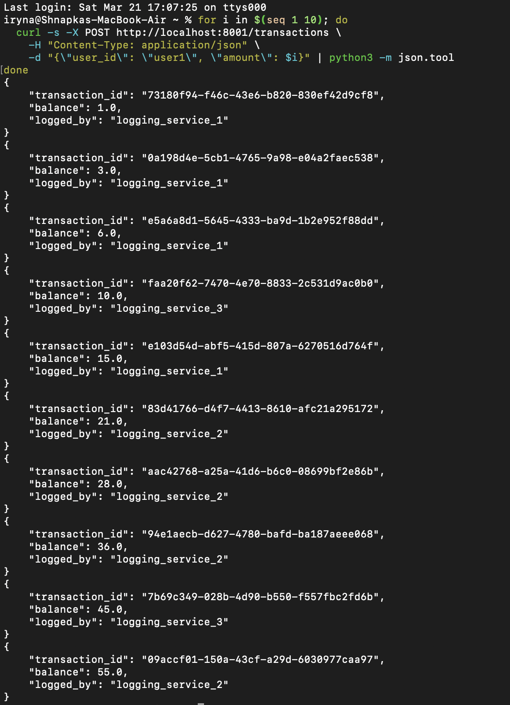

### Logs of each logging_service instance

Each instance prints which transactions it personally received. But since all data goes to the shared Hazelcast map, any instance can read all transactions — not just the ones it wrote.

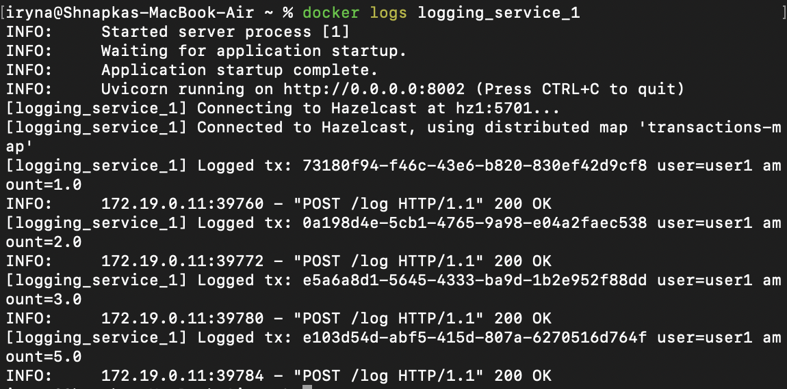
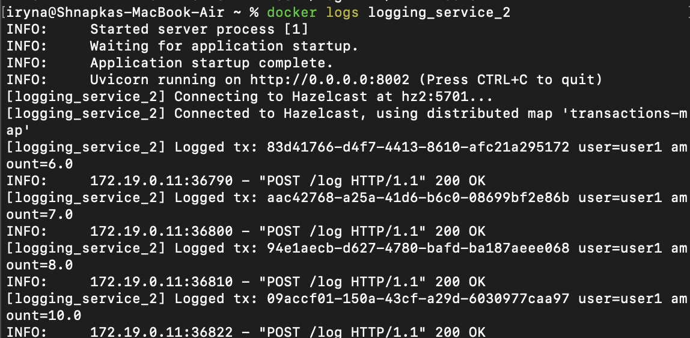
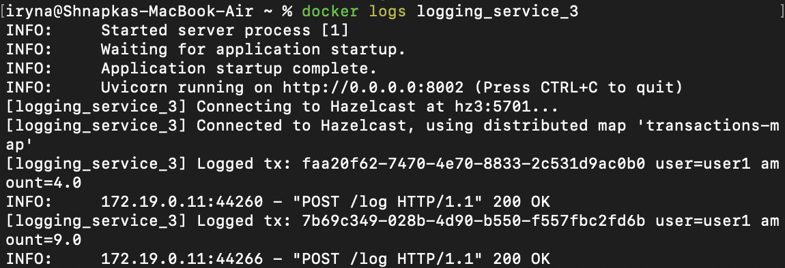

### GET all messages

I read all transactions back through facade_service:

```bash
curl -s http://localhost:8001/messages | python3 -m json.tool
```

All 10 transactions are returned, even though they were written by 3 different instances. This works because they all write to the same Hazelcast Distributed Map.

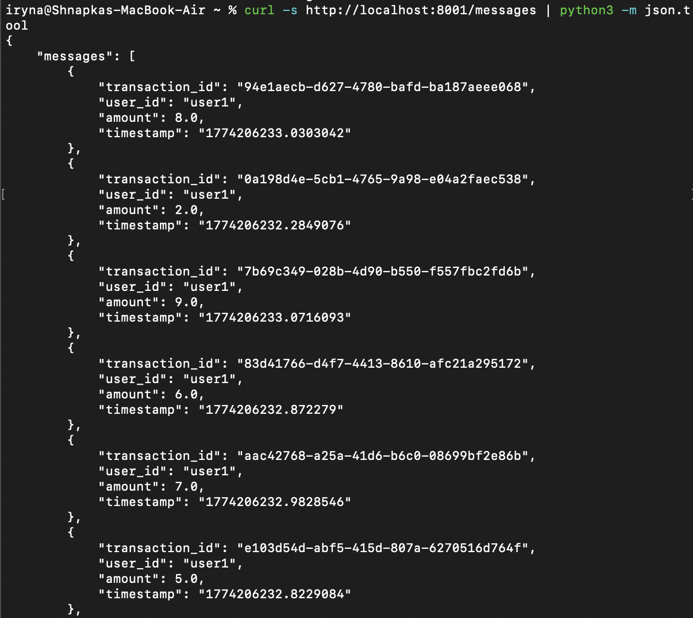


---

## 5. Turning off logging instances

### Stop 1 instance

```bash
docker stop logging_service_1
```

I stop `logging_service_1` and then send a new transaction. facade_service tries `logging_service_1` first, gets no response, and immediately tries the next one. The transaction is written successfully by `logging_service_3`. All previous data is still readable because it lives in Hazelcast, not inside the stopped instance.

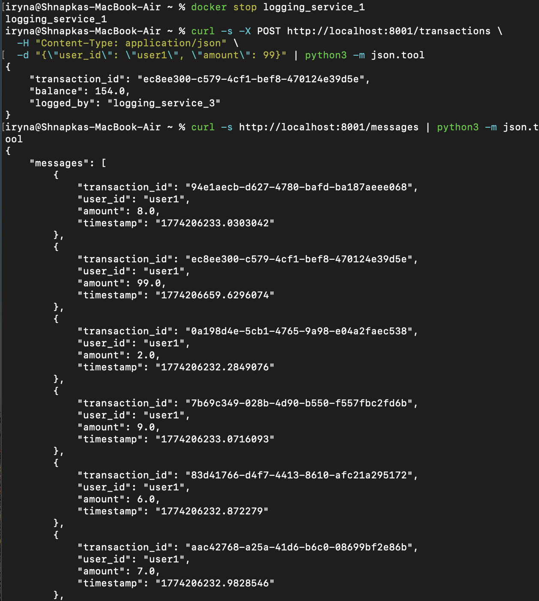


### Stop 2 instances

```bash
docker stop logging_service_2
```

Now only `logging_service_3` is running. The system still works, facade_service finds the only available instance and uses it. All 12 transactions (10 original + 2 new) are still readable.

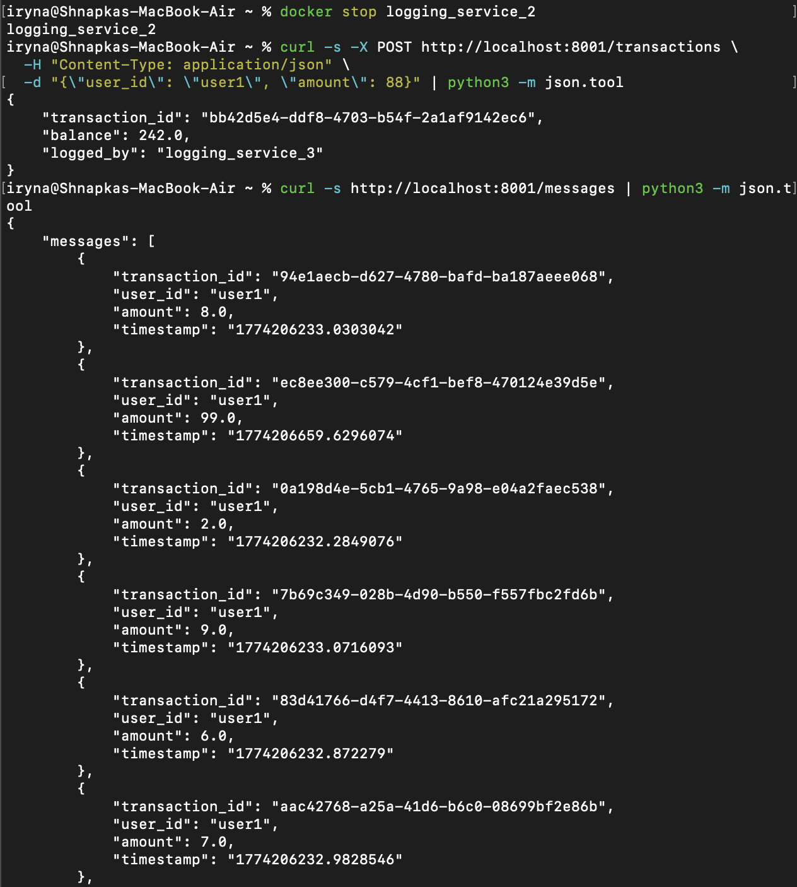
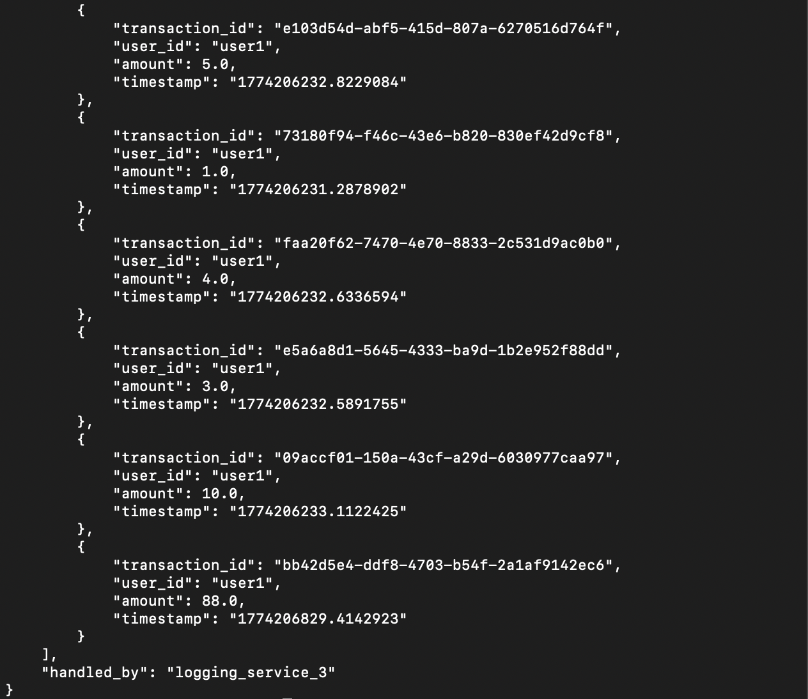

---

## 6. Turning off Hazelcast nodes

### Stop 1 node

```bash
docker start logging_service_1 logging_service_2
docker stop hz1
```

I bring back the logging instances and stop one Hazelcast node. `logging_service_1` is connected to `hz1` which is now down, but `logging_service_2` is connected to `hz2` which still works. facade_service routes to `logging_service_2` and the transaction goes through. No data is lost because Hazelcast keeps copies of data on multiple nodes.

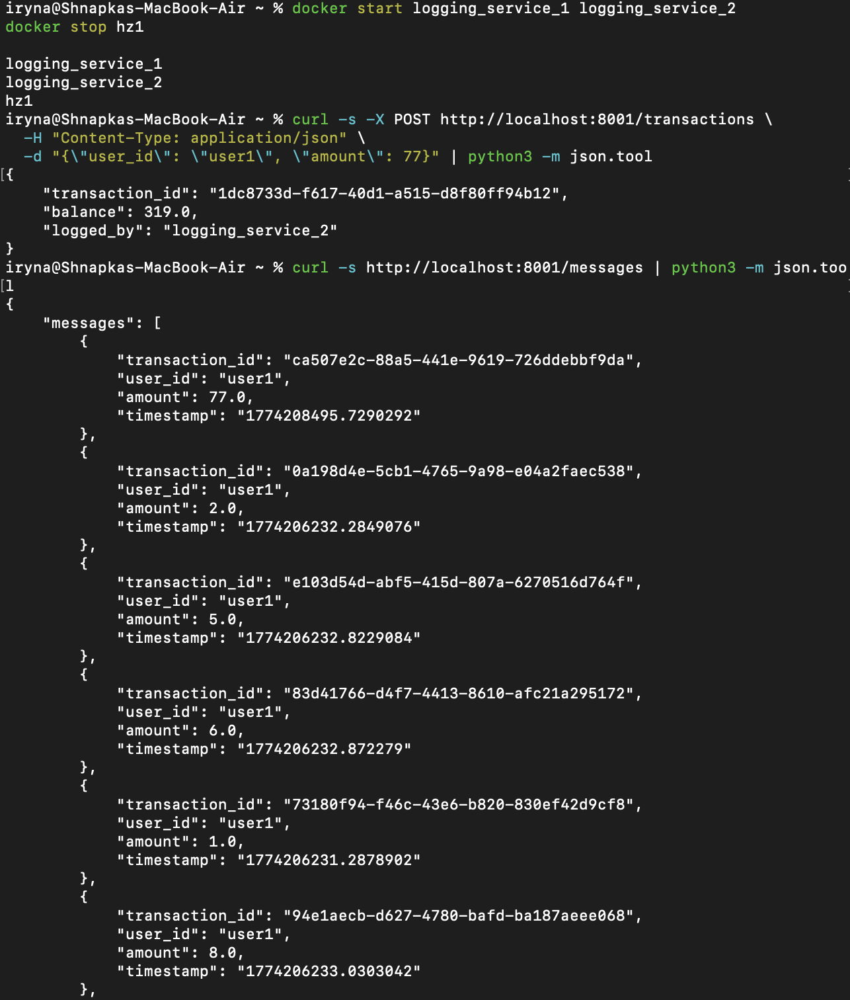
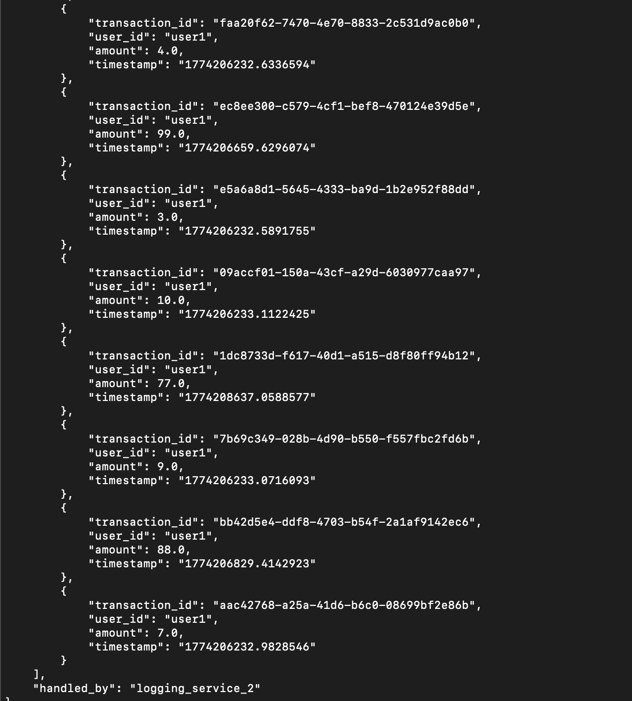

### Stop 2 nodes

```bash
docker stop hz2
```

Now both `hz1` and `hz2` are stopped. Only `hz3` is left, but `logging_service_3` was already stopped earlier. So all 3 logging instances either cannot reach their Hazelcast node or are stopped. The system returns `All logging instances unavailable`.

This is expected — it is the same limitation we saw in Lab 2. When too many nodes fail at the same time, the system cannot recover on its own.

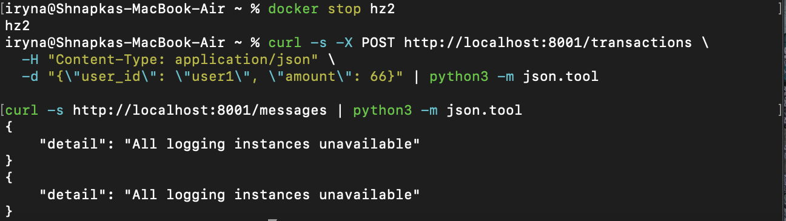

---

## 7. Load test

We restart everything and run the same load test as in Lab 1:

```bash
docker start hz1 hz2
python3 load_test.py
```

### Scenario 1 – 10 users, 10k transactions each, separate accounts

10 users each send 10,000 transactions to their own account. Every account should end with balance 10,000.

- Lab 1: total time ~1147s, RPS ~87, all balances correct
- Lab 3: total time ~846s, RPS ~118, all balances correct

Lab 3 finished about 5 minutes faster and handled ~35% more requests per second.

**Lab 1 result:**

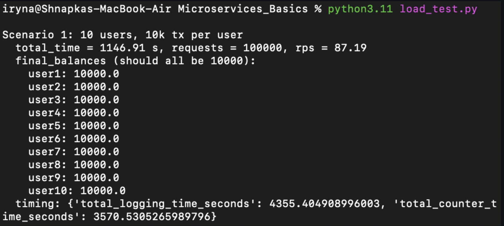

**Lab 3 result:**

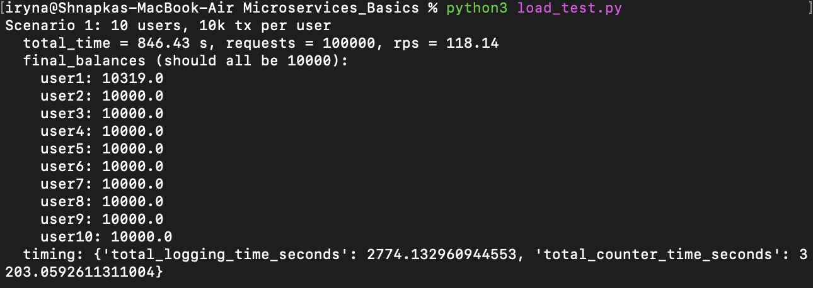

### Scenario 2 – 10 clients, 10k transactions each, same user

10 clients all send transactions to one shared account. The final balance should be 100,000.

- Lab 1: total time ~1145s, RPS ~87, final balance 100,000
- Lab 3: total time ~811s, RPS ~123, final balance 100,000

Again Lab 3 is faster and the result is correct.

**Lab 1 result:**

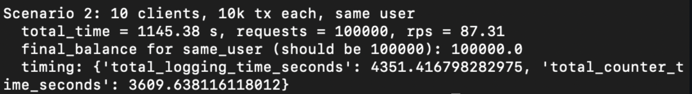

**Lab 3 result:**

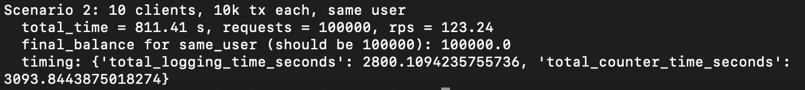

---

## 8. Results and conclusion

Lab 3 is about 35% faster than Lab 1 in both scenarios. The main reasons are:

**PostgreSQL is better under high load than Python in-memory dict.** When many requests come in at the same time, Python has to handle them one by one because of how it manages memory internally. PostgreSQL handles concurrent writes natively and uses atomic operations to update balances safely without losing any data.

**3 logging instances spread the work.** In Lab 1, one logging_service had to handle every single request. In Lab 3, the load is split across 3 instances, so each one does less work.

**Hazelcast keeps data safe.** Even when instances or nodes go down, the data stays accessible as long as at least one node is running. This makes the system much more reliable compared to Lab 1 where any restart would wipe all logs.
